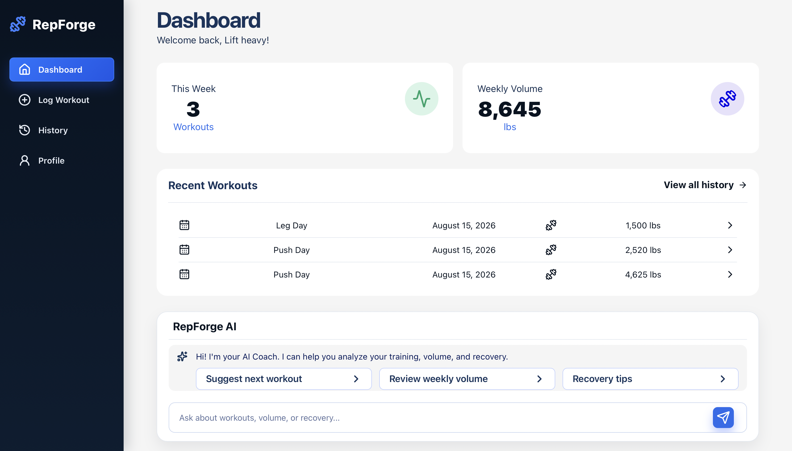
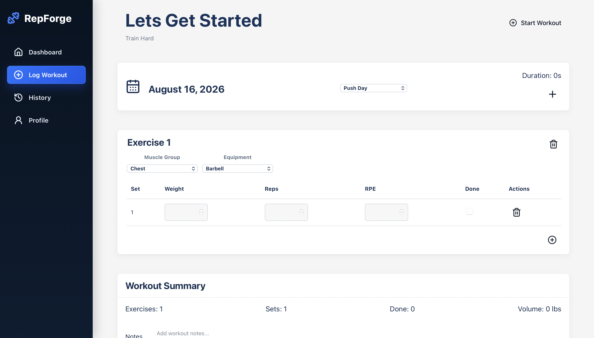
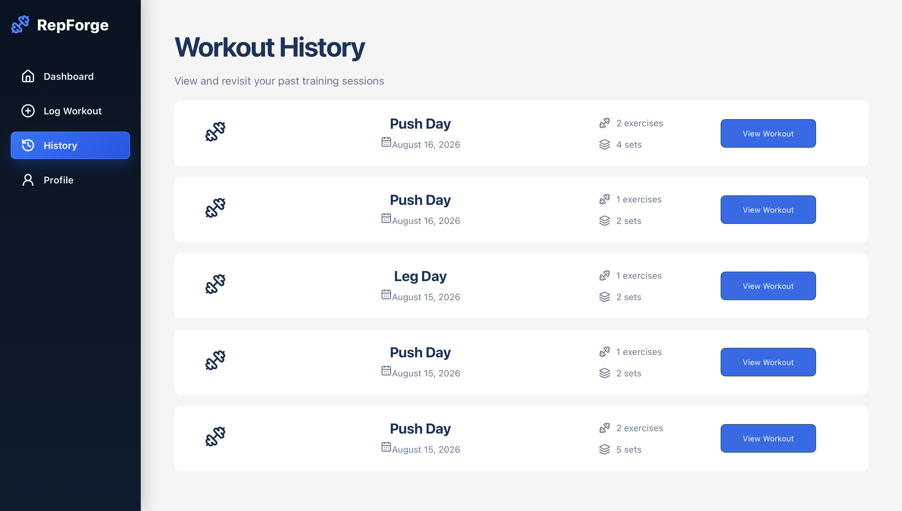
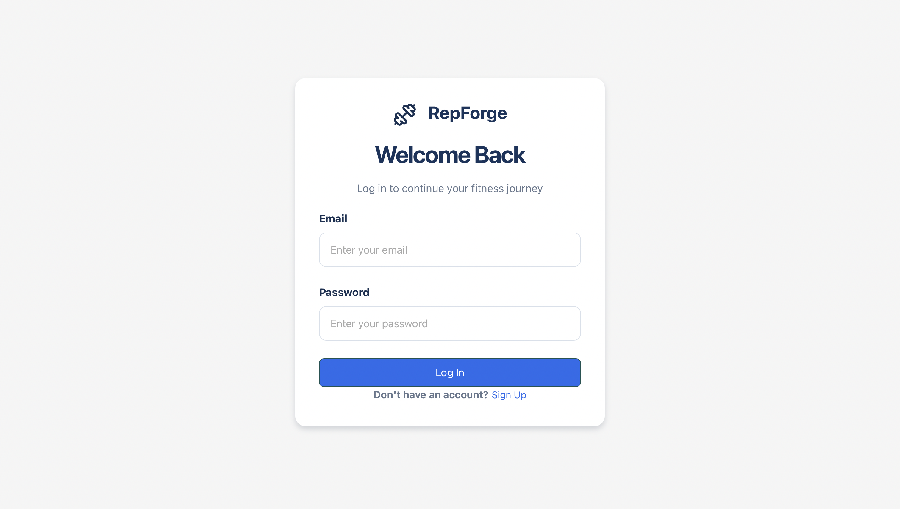

# RepForge

RepForge is a full-stack workout tracking web application that allows users to create accounts, log workouts, review previous training sessions, and track workout statistics.

The project was built to practice full-stack software development, REST API design, relational databases, authentication, and deploying a multi-service web application.

## Live Demo

**Live Application:** [RepForge](https://repforge-flame.vercel.app)

---

## Features

* User registration and login
* JWT-based authentication
* Secure password hashing
* Create and log workouts
* Add multiple exercises to a workout
* Add multiple sets to each exercise
* Track weight, repetitions, RPE, and completed sets
* Save workouts to a PostgreSQL database
* View workout history
* View detailed information for previous workouts
* Delete saved workouts
* Workout dashboard and training statistics
* Responsive interface for desktop and mobile devices

---

## Tech Stack

### Frontend

* React
* Vite
* JavaScript
* React Router
* CSS
* Lucide React

### Backend

* Node.js
* Express.js
* PostgreSQL
* `pg`
* JSON Web Tokens (JWT)
* bcrypt
* REST APIs

### Deployment

* Vercel — Frontend
* Render — Backend API
* Neon — PostgreSQL database

---

## Screenshots

### Dashboard



### Workout Logger



### Workout History



### Login



> Screenshot paths can be changed depending on where the images are stored in the repository.

---

## Project Structure

```text
RepForge/
│
├── Backend/
│   ├── middleware/
│   ├── routes/
│   ├── db.js
│   ├── server.js
│   └── package.json
│
├── Frontend/
│   ├── public/
│   ├── src/
│   │   ├── components/
│   │   ├── pages/
│   │   ├── App.jsx
│   │   ├── App.css
│   │   └── main.jsx
│   └── package.json
│
├── Data/
├── .gitignore
└── README.md
```

The frontend communicates with the Express backend through REST API requests. The backend handles authentication, workout data, and database operations using PostgreSQL.

---

## Application Architecture

```text
React Frontend
      |
      | HTTP / REST API
      v
Express + Node.js Backend
      |
      | SQL Queries
      v
PostgreSQL Database
```

The application is separated into three main layers:

**Frontend**
React handles the user interface, application state, routing, workout forms, and communication with the backend.

**Backend**
Express provides REST API endpoints for authentication, workouts, workout history, and other application data.

**Database**
PostgreSQL stores users, workouts, exercises, and individual workout sets.

The database uses relationships between workout data:

```text
User
  |
  v
Workout
  |
  v
Exercise
  |
  v
Set
```

---

## Running RepForge Locally

### 1. Clone the repository

```bash
git https://github.com/Emiko-Codes/RepForge
```

Move into the project:

```bash
cd RepForge
```

---

### 2. Install backend dependencies

Move into the backend directory:

```bash
cd Backend
```

Install the dependencies:

```bash
npm install
```

---

### 3. Configure backend environment variables

Create a `.env` file inside the `Backend` directory.

```env
DATABASE_URL=your_postgresql_connection_string
JWT_SECRET=your_jwt_secret
PORT=5000
```

Do not commit the `.env` file to GitHub.

---

### 4. Start the backend

From the `Backend` directory:

```bash
npm start
```

If the project uses a development script:

```bash
npm run dev
```

---

### 5. Install frontend dependencies

Open another terminal and move into the frontend directory:

```bash
cd Frontend
```

Install the dependencies:

```bash
npm install
```

---

### 6. Configure frontend environment variables

Create a `.env` file inside the `Frontend` directory.

```env
VITE_API_URL=http://localhost:5000
```

For production, this value points to the deployed backend API instead.

---

### 7. Start the frontend

```bash
npm run dev
```

Vite will provide a local development URL in the terminal.

---

## Environment Variables

### Backend

| Variable       | Purpose                                              |
| -------------- | ---------------------------------------------------- |
| `DATABASE_URL` | PostgreSQL database connection string                |
| `JWT_SECRET`   | Secret used to sign and verify authentication tokens |
| `PORT`         | Port used by the Express server                      |

### Frontend

| Variable       | Purpose                         |
| -------------- | ------------------------------- |
| `VITE_API_URL` | URL of the RepForge backend API |

Sensitive environment variables are excluded from Git using `.gitignore`.

---

## Database Design

RepForge uses a relational PostgreSQL database.

The main tables include:

### Users

Stores account information and hashed passwords.

### Workouts

Stores information about each workout session.

### Exercises

Stores exercises associated with individual workouts.

### Sets

Stores set information such as:

* Weight
* Repetitions
* RPE
* Completion status

Foreign-key relationships connect workouts, exercises, and sets so that a complete workout can be reconstructed from the database.

---

## Notable Technical Implementations

### Authentication

RepForge uses JSON Web Tokens to authenticate users.

When a user logs in successfully:

1. The backend verifies the user's credentials.
2. bcrypt verifies the supplied password against the stored password hash.
3. The backend creates a JWT.
4. The frontend stores the token.
5. Protected API requests include the token in the `Authorization` header.

---

### Nested Workout Data

A workout contains multiple exercises, and each exercise can contain multiple sets.

The frontend manages this nested data structure before sending it to the backend.

The backend then stores the workout across related PostgreSQL tables.

---

### Database Transactions

Saving a complete workout involves multiple database operations.

Database transactions are used so that either the entire workout is successfully saved or the operation is rolled back if an error occurs.

This helps prevent partially saved workout data.

---

### REST API

The frontend communicates with the backend through REST API endpoints for operations including:

* Authentication
* Creating workouts
* Retrieving workout history
* Retrieving individual workouts
* Deleting workouts
* Retrieving dashboard information

---

## What I Learned

Building RepForge strengthened my understanding of full-stack software development and how different parts of an application communicate with each other.

Some of the main concepts I practiced include:

* Building reusable React components
* Managing React state
* Working with nested JavaScript objects and arrays
* Creating controlled form inputs
* Client-side routing with React Router
* Creating REST API endpoints with Express
* Sending HTTP requests between a frontend and backend
* Designing relational PostgreSQL tables
* Writing SQL queries
* Using foreign keys and relationships
* Using database transactions
* Implementing authentication with JWT
* Hashing passwords securely with bcrypt
* Protecting API routes with authentication middleware
* Managing environment variables
* Handling frontend and backend errors
* Deploying a frontend, backend, and database separately
* Connecting deployed services together in production

---

## Future Improvements

Possible future improvements include:

* More advanced workout analytics
* Exercise progress visualizations
* Personal record tracking
* Additional profile customization
* Improved training insights

---

## Author

**Emiko**

Software Engineering Student

GitHub: [Emiko-Codes](https://github.com/Emiko-Codes)

